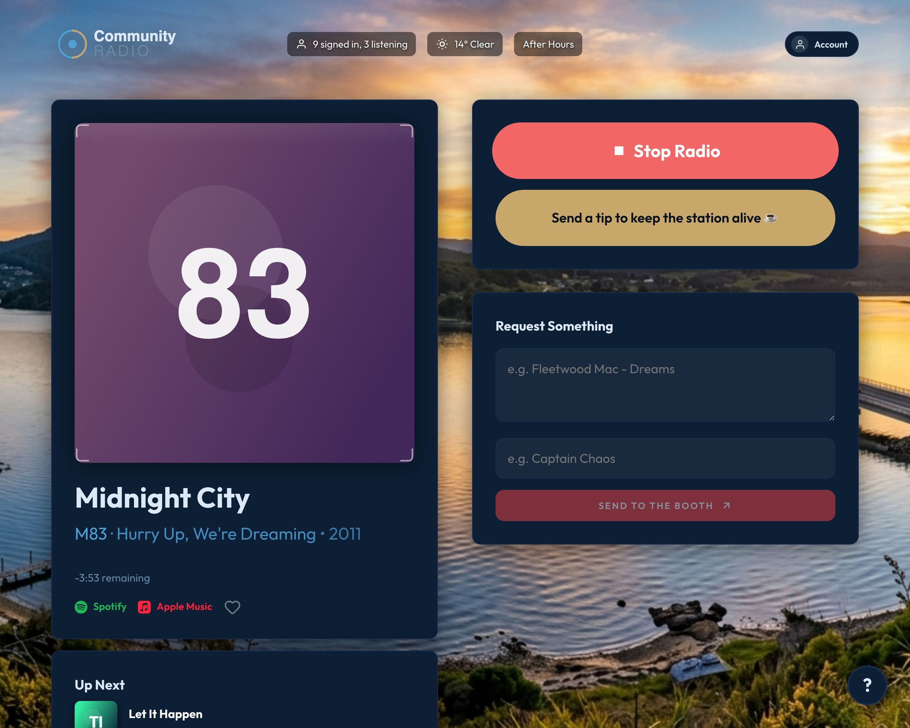
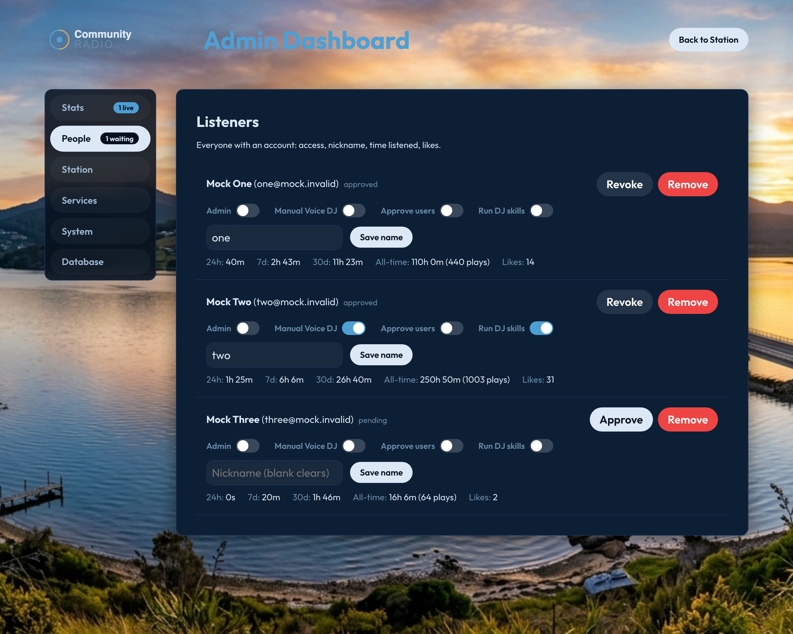

<h1 align="center">Subwave Listener</h1>

<p align="center">
  A listener-facing web player for a <a href="https://github.com/perminder-klair/subwave">SUB/WAVE</a> radio station.<br>
  Approvals-gated streaming, live now-playing, requests, likes, and an admin dashboard.
</p>

<p align="center">
  
</p>

<p align="center"><sub>
  Rendered locally against mock data. The component, stylesheet and audio pipeline are the real ones —
  the station, tracks and listener counts are invented.
</sub></p>

---

> **This is unofficial companion software.** It is not a SUB/WAVE product. It is
> not affiliated with, endorsed by, or supported by the SUB/WAVE project or its
> author. It is a separate program that talks to a SUB/WAVE station over that
> project's public HTTP interface — the same interface any other listener app
> would use. If something here breaks, it is a bug here, and please report it
> here rather than to them.

---

## Contents

- [What it does](#what-it-does)
- [How it fits together](#how-it-fits-together)
- [Words used in this guide](#words-used-in-this-guide)
- [What you need before you start](#what-you-need-before-you-start)
- [Quick start](#quick-start)
- [After your first sign-in](#after-your-first-sign-in)
- [Documentation](#documentation)
- [Branding your player](#branding-your-player)
- [Security notes](#security-notes)
- [Versions and updating](#versions-and-updating)
- [Licence](#licence)

---

## What it does

### For the people listening

- **Sign in to listen.** People sign in with a Google account. Until you approve
  them they cannot hear any audio at all — not a preview, not a few seconds.
  You can revoke or delete an account at any time, and it takes effect
  immediately.
- **The screen matches what you can hear.** Your station streams a little ahead
  of the live edge so it has room to switch tracks smoothly. That means the
  title and artwork usually appear a few seconds *after* the track technically
  starts. This app waits for that moment before updating the screen, so what you
  read is what you are hearing. A countdown shows how much of the current track
  is left.
- **A short guided tour** the first time somebody signs in, explaining each part
  of the page. It appears as a panel over the page rather than a separate screen,
  so it never interrupts the music, and the `?` button in the corner brings it
  back.
- **Liked songs.** Each listener has their own list. Every track on it links
  straight to Spotify and Apple Music. A listener can hide their name on the
  list if they would rather not be identified.
- **Song requests**, with an optional name, sent to whoever is running the
  station.
- **Installable.** It can be added to a phone or computer's home screen and then
  behaves like a normal app, including lock-screen controls showing the current
  track.
- **A Skip button**, which you choose who sees. See
  [Skip Control](docs/settings.md#skip-control--applies-on-the-next-page-load).

### For the person running the station

- **One password to one dashboard**, covering who may listen, what they have
  listened to, your station's name and branding, the connection to your station,
  the tip button, and phone notifications.
- **Runs on SQLite or Postgres**, and can move from one to the other from the
  dashboard. The move copies every row, checks the two copies match, and only
  then switches — and it refuses to start while anybody is listening, so nobody
  gets cut off mid-song.
- **Personal details encrypted.** Names, email addresses and the email addresses
  of people who sent you money are encrypted before they are stored. The email
  address column holds a one-way fingerprint of the address rather than the
  address itself, so people can still sign in without the address being readable
  in the database.
- **A tip button**, connected to Buy Me A Coffee, with a signed webhook so only
  genuine payments create entries.
- **Per-listener DJ skills**, switched off for everyone by default. You choose
  who gets them; until you do, the feature is not visible to them at all.

---

## How it fits together

```
  listener's phone or laptop
            │
            │  https://your-station.example.com
            ▼
   ┌─────────────────────┐
   │   This application  │   the web page people listen on
   │   (Subwave Listener)│   + an admin dashboard only you can reach
   └──────────┬──────────┘
              │
              │  one connection, out to your station
              ▼
   ┌─────────────────────┐
   │  Icecast relay      │   re-sends one incoming stream to many listeners
   └──────────┬──────────┘
              │
              ▼
   ┌─────────────────────┐
   │  Your SUB/WAVE      │   the music, the AI DJ, your library
   │  station            │
   └─────────────────────┘
```

**The relay is the part worth understanding.** Your station sends its audio out
over one connection. The relay sits in the middle and re-sends it to every
listener. Without it, every listener would need their own connection back to
your station, and a home internet connection would give up long before a handful
of people. With it, your station uploads once no matter how many people are
listening.

`docs/listener-modes.md` explains this in more detail, including when you would
prefer to skip the relay.

**You need a SUB/WAVE station already running.** This application is the
front end, not the radio.

---

## Words used in this guide

You will meet all of these. Each one says what it is, whether you need it, and
what happens if you leave it out.

### SUB/WAVE — **required**

The radio station itself: it holds your music, runs the AI DJ, and produces the
audio stream. This application does none of that; it is the website people use
to listen to the stream your station is already broadcasting. You cannot use this
application without one.

### Google sign-in — **required**

**What it is.** Google provides a "sign in with Google" button. It is the only
way anybody can sign in to your player. There is no username-and-password option.

**Why it is here.** A private station needs to know who is listening, so it needs
accounts. Building and running a password system means storing passwords,
handling resets and dealing with people who forget them. Handing that to Google
means people sign in with the account they already have, and you never see or
store their password.

**What you need.** A free Google account, and about ten minutes in the Google
Cloud Console to create an application and get an ID and a secret. Google gives
these away free; there is nothing to pay and no billing to set up.

**If you leave it out.** Nobody can sign in, so nobody can listen.

`docs/deployment.md` has the step-by-step.

### An Icecast relay — **strongly recommended, one alternative exists**

**What it is.** Icecast is free software for sending a live audio stream to many
people. A "relay" is one running somewhere in the middle, holding a single
connection from your station and re-sending the audio onwards to every listener.

**Why it is here.** Your station uploads its audio once. The relay does the
fanning out. This is what lets a station on a home internet connection serve a
crowd.

**What you need.** Icecast installed and running on the machine running this
application, configured to pull from your station. If you already run a relay,
point this application at it. If not, the setup is in
`docs/listener-modes.md`.

**If you leave it out.** You can switch the player to "direct" mode instead, where
every listener connects straight to your station. Your station will then use one
of its own upload for every single listener, so a modest home connection will
struggle with more than a handful of people. Workable for a small station;
not for a busy one.

### A network overlay such as Tailscale — **optional**

**What it is.** Overlay software that links your own devices together over the
internet as if they were on the same local network, giving each one a private
address that nobody outside your group can reach. Tailscale is the best-known
one; WireGuard-based tools do the same job.

**Why you might want it.** Two situations, both about reachability:

- Your station is at home, and your home internet is behind carrier-grade NAT —
  the kind where your router does not have a public address of its own, so there
  is nothing to forward a port to. Many people solve this by forwarding over
  IPv6, and many cannot, because their provider does not give them one.
- Your relay's admin page — the page that shows how many people are connected —
  has to be reachable by your station so it can report a listener count. You may
  not want that page open to the whole internet.

An overlay solves both without opening a single port on your router.

**What you need.** Nothing from us. Install it on whichever machines need to see
each other and sign them into the same account. It is free for a small number of
machines.

**If you leave it out.** Entirely fine, as long as your two machines can already
reach each other some other way — a port forward over IPv4, or a port forward
over IPv6. The overlay is a convenient way to avoid opening ports, not a
requirement. `docs/listener-modes.md` covers the alternatives.

### SQLite — **required (but included)**

**What it is.** A database that is a single ordinary file. You can copy it with
`cp` and back it up with `cp`.

**Why it is here.** It holds your listeners' accounts, their likes, their
requests and their listening history.

**What you need.** Nothing. It ships with Node.js and needs no separate
installation and no separate server.

**If you leave it out.** You cannot run the station at all. But you do not need to
think about it — see the Postgres section below.

### Postgres — **optional**

**What it is.** A larger, separate database server. It runs as its own program on
its own machine, or as a service you pay a small monthly fee for.

**Why you might want it.** SQLite is genuinely fine for a station this size, and
most people should stay on it. Move to Postgres if you want the database off the
same disk as the application, if you would rather not rebuild your data after
replacing the server's disk, or if you simply expect to grow.

**What you need.** A Postgres server, a database, a username and password, and a
few SQL commands run once as an administrator. Both free and paid options exist.

**If you leave it out.** Nothing. This is the default and the recommended
starting point. `docs/deployment.md` explains how to move later, and the
dashboard will do the actual moving for you.

### Buy Me A Coffee — **optional**

**What it is.** A small website people can send you a tip through.

**Why it is here.** It is the tip button on the player. When somebody tips you,
Buy Me A Coffee sends a notification to this application, which adds it to your
list in the admin dashboard.

**What you need.** A free Buy Me A Coffee account, and a secret string they give
you to paste in. It is the only donation service supported — the code that
receives the notification understands Buy Me A Coffee's format and no one else's.

**If you leave it out.** The tip button stays hidden. Nothing else changes.

### Spotify — **optional**

**What it is.** A music streaming service, and a developer service that can look
up where a track is available.

**Why it is here.** When a track is playing, the player shows a link to it. With
Spotify credentials, that link goes to the actual track. Without them, it goes to
a Spotify search results page for that track's name — still useful, just less
direct. Apple Music links need no credentials at all, and are always exact.

**What you need.** A free Spotify developer account and an application, which
takes about five minutes. No billing, no redirect URL to configure.

**If you leave it out.** Links become searches instead of direct links. Nothing
breaks.

### Node.js — **required**

**What it is.** The programming language runtime this application is written in.
You install it once; it runs the application.

**Why it is here.** It is the software that executes the app.

**What you need.** **Version 20.9 or newer.** This is the minimum the underlying
framework supports. It has been tested on version 20.20.2, which is what the
reference deployment runs. Later versions should be fine.

---

## What you need before you start

| | Needed for | Required? |
|---|---|---|
| Node.js 20.9+ | running the application | **Required** |
| A SUB/WAVE station, already running | the music | **Required** |
| Google Cloud credentials | sign-in | **Required** |
| A server with a domain name | hosting | **Required** |
| An Icecast relay | audio for more than a few listeners | Strongly recommended |
| Postgres | only if you outgrow SQLite | Optional |
| Buy Me A Coffee | the tip button | Optional |
| Spotify credentials | direct track links | Optional |
| A network overlay (e.g. Tailscale) | only if your machines cannot otherwise reach each other | Optional |

You also need somewhere to run it. A small VPS is the usual answer and is what
this is designed for: it is a tiny application that wants a public address and
an SSL certificate, and a VPS is the easiest place to get both. Any host that can
run Node.js 20.9 and give you a domain and a certificate will do.

`docs/deployment.md` walks through the whole thing.

---

## Quick start

Four commands, then a browser. The setup wizard asks the rest.

```bash
git clone https://github.com/scottchristian/subwave-listener.git
cd subwave-listener
npm install
npm run build && npm start
```

Then open **<http://localhost:3000/setup>**.

You do not need a `.env.local` file, and you do not need to generate any keys
yourself — the wizard writes its own configuration and creates its own database.

### What the wizard asks

| Step | What it needs from you |
|---|---|
| **Running as root?** | Nothing — it offers to fix it, or prints the commands. |
| **Security keys** | Nothing. It generates them and shows you the one that matters. |
| **Sign-in** | A Google Cloud project (about five minutes, and the wizard walks you through it), plus your own email address |
| **Database** | Nothing if you take the recommendation. |
| **Your station** | The public address of your SUB/WAVE station. Its name is read back from the station once the connection is tested — edit it only if you want the player to say something different. |

### The one thing it cannot do for you

**Google sign-in has to be set up on Google's website.** Nobody can automate it —
it is a page that asks *you* to confirm the application belongs to you. The
wizard gets you there, shows you the exact redirect address to paste, and then
checks your entry for the mistakes that account for almost every failed sign-in
(a wrong redirect address, a client ID pasted where the secret belongs, an
`http://` address where Google wants `https://`).

What it cannot verify until you actually sign in is whether Google *accepts* your
client secret. Nothing can — verifying it requires an authorisation code, which
only exists once you have been to Google and come back. The wizard says so rather
than reporting a test it did not run.

### The key you must not lose

The wizard generates an **encryption key** and shows it once. It protects every
listener name, email address and tip your station stores.

If you lose it, that data cannot be read by anyone, including you. There is no
reset, because there is nowhere to reset it from. The wizard will not let you
continue until you have confirmed you have stored it somewhere else.

### After setup

The wizard closes itself and becomes unreachable — permanently, on purpose. It
writes your Google credentials, so leaving it open would let anyone who found the
address take the station over. From then on, every setting it asked for lives in
**Admin**, behind sign-in.

If you ever need to run it again — to change your Google credentials, say — delete
the `.setup-complete` file next to your `.env.local` and restart the application.

### Setting up without the wizard

Plenty of people prefer to do this by hand, and every value the wizard sets is a
normal environment variable. Copy the template and fill it in:

```bash
cp .env.example .env.local
nano .env.local        # Ctrl+O then Enter to save, Ctrl+X to quit
```

`.env.example` documents every setting inline. You will need to generate two
values yourself:

```bash
openssl rand -base64 32     # → NEXTAUTH_SECRET
openssl rand -hex 32        # → PII_ENCRYPTION_KEY
```

…then create the database:

```bash
set -a; . ./.env.local; set +a
npx prisma generate
npx prisma migrate deploy
npm run dev
```

> The `set -a; . ./.env.local; set +a` line is not decoration. Next.js reads
> `.env.local`, but the database tool reads a file called `.env` — a different
> name — so without that line every Prisma command fails with
> `Environment variable not found: DATABASE_URL`.

`docs/deployment.md` covers both routes in full, and the manual one in more detail.

> **One detail both routes share:** a `file:` path is relative to
> `prisma/schema.prisma` inside the project, not to the folder you are standing
> in. `file:./data/app.db` lands in `prisma/data/`. Use `file:../data/app.db` for a
> `data` folder alongside the project.

### Putting it on a server

Everything above runs on your own machine, which nobody else can reach.
`docs/deployment.md` covers moving it to a server with a domain name and a
certificate — including a note if you would rather run it as an unprivileged
user, which you should.

---

## After your first sign-in

A few things worth doing straight away:

- **Admin → Station → Sub/Wave Server.** Press Test. It tells you whether this
  application can reach your station. If it cannot, nothing else will work, so
  fix this first.
- **Admin → People.** This is where you approve listeners. Somebody who signs in
  appears as *pending* and hears nothing until you approve them.
- **Admin → Station → Identity.** Set your station's name, description and logo.
  Saving rebuilds the application, which takes about a minute and interrupts
  playback — so do it when nobody is listening.
- **Admin → Station → Skip Control.** Decide who gets the Skip button. The
  default shows it only when the listener is alone, which is usually what people
  want.

`docs/settings.md` explains every setting, including which ones apply
immediately and which need a restart.

---

## Documentation

| | |
|---|---|
| [**docs/deployment.md**](docs/deployment.md) | Putting it on a server: domain name, SSL certificate, Google sign-in step by step, keeping it running, backups, upgrades, moving to Postgres |
| [**docs/settings.md**](docs/settings.md) | Every setting, what it does, and whether it applies immediately |
| [**docs/listener-modes.md**](docs/listener-modes.md) | How the audio reaches people, the relay, listener counting, and getting your machines to see each other |
| [**CONTRIBUTING.md**](CONTRIBUTING.md) | For people who want to change the code |

---

## Branding your player

One copy of this application serves **one** station, and you brand it however you
like. There is no multi-station mode and none is planned — the software is
generic, but a single instance is configured for a single station.

Everything about how it looks is yours:

- **Name, tagline, description and the text on the sign-in screen** — from
  **Admin → Station → Identity**, or by editing the `NEXT_PUBLIC_STATION_*` lines.
- **Logo** — upload it in the same place. It is used in the header, on the
  sign-in screen, and as the app icon on phones. A wide logo, roughly five times
  wider than it is tall, suits the header best.
- **Background image** — upload it in the same place, or drop it at
  `data/brand/bg.jpg`. Because text sits directly on top of it, a dark or
  low-contrast picture works best.

  Uploads land in `data/brand/`, which belongs to your station alone: the
  repository ships placeholders in `public/defaults/` and a deploy replaces those,
  never yours. The site asks for a fixed `/brand/...` address either way, so
  changing your artwork takes effect immediately — no rebuild, no restart.
- **Colours and fonts** — `app/globals.css`. The main ones are near the top, as
  CSS variables.

`lib/station.ts` holds the name and description values. It is the only file to
edit for branding. Its built-in fallbacks are neutral placeholders, not anybody's
station — so if you see "Community Radio" anywhere, that is a setting you have
not filled in yet.

<p align="center">
  
</p>

---

## Security notes

The things this application is deliberate about, because they are easy to get
wrong:

- **The admin area is protected on the server, not in the browser.** `/admin`,
  `/likes` and every `/api/` route all require a real signed-in session. There
  are three deliberate exceptions, each documented where it is defined: the
  sign-in flow itself, your station's own fetch of the tip list, and the signed
  webhook from Buy Me A Coffee. Hiding a button is not the same as protecting
  something, and neither is redirecting in the browser — so the check happens
  before the route runs.
- **Encrypted data is never sent to a browser.** If a page needs your listeners'
  names, it decrypts them deliberately on the server first. `npm run check:pii`
  looks for the cases where one might slip through.
- **Your station password never travels in a web address.** Web addresses end up
  in server logs, browser history and other websites' referrer headers, so this
  sends it as a header instead. The one place it appears in a URL is the direct
  audio stream, which has to be a URL because a browser's audio element cannot
  send headers — the same reason SUB/WAVE documents it.
- **Tips are only accepted from a genuine signed request**, and a payment
  notification that arrives twice does not create two entries.
- **`npm run check:refs` fails if your own server details reach these
  documents.** It exists because that happened once: a design note was
  committed with a real address and hostname in it, in a public repository.

---

## Versions and updating

Releases are published on this repository's
[releases page](https://github.com/scottchristian/subwave-listener/releases), each
with its own tag (`v0.0.1`, `v0.0.2`, …) and its own notes. That page is the
canonical list of what has changed — check it before upgrading.

### Finding out what you are running

The player footer carries the version, on every page, at the bottom:

> Subwave Listener 0.0.1 · unofficial companion software

That number is read from `package.json` at build time, and it is the same string
the release is tagged with, so it cannot drift from either. If you are not sure
what is deployed, that is the number to quote in a bug report.

### Knowing an update exists

**Admin → System → Software** shows the installed version, and says so plainly when
a newer release has been published, with a link to its notes. It checks once an
hour; a station that cannot reach GitHub simply sees nothing, which is not an
error.

### Upgrading

Nothing updates itself, and that is deliberate. A deploy rebuilds the player and
restarts the process, which would cut off anyone listening at the time, so the
decision is left to a person who can see the room is empty. Your deploy script
should refuse to run while the station has listeners — pass `--force` only when you
mean it.

Upgrading from a release is an ordinary deploy: pull the tag, `npm ci`, build,
restart. Your configuration lives in the environment and in the database, not in
the checkout, so nothing needs migrating between patches.

You can also update from **Admin → System → Software** instead of deploying by
hand. Pick stable (a newer release), main, or develop; the station takes a
settings backup first, validates it, then downloads, rebuilds and restarts —
refusing while anyone is listening unless you accept interrupting them. If the
build fails it rolls back to the backup automatically; if a booted version turns
out bad, roll back from the same panel. Nothing updates itself on a schedule —
every update is started by a person.

### Backups

**Admin → System → Backups** snapshots everything that makes the station yours:
the settings file, the whole database, the station artwork and the setup marker.
Take one before upgrading, and download one to keep somewhere off the server —
snapshots on the server alone do not survive losing the server. Restoring one
puts all four back and restarts the station on them.

### If you maintain a fork

The update check points at this repository's releases, so a fork sees no updates
rather than being told to pull code that is not yours. To follow your own releases,
change `REPO` in `lib/version.ts` — the version itself comes from `package.json`.

---

## Licence

MIT. See [LICENSE](LICENSE) for the full text.

You may use, modify and self-host this freely, including commercially. The one
condition is that the MIT licence text and copyright notice come with any
copies you distribute.
